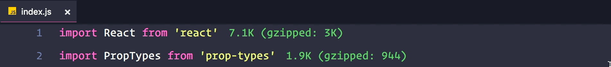
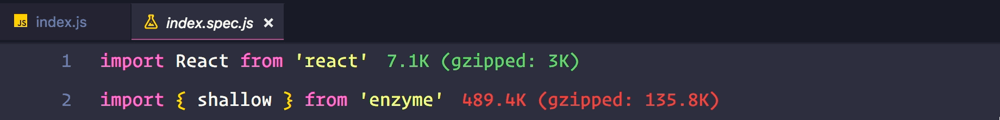

# Go to Spec

This extension allows you to switch between your code and its test file like Intellij IDEs.

## Features

* You can switch from code to spec file.
* You can switch from test to code.

## Using

Calls `Go to Spec` command (cmd+shift+t or ctrl+shift+t).

#### Go to spec

#### Go to code

* Your spec may be in the same folder of the code with `spec` or `test` in suffix of the file.
* Your spec may be in a different folder of the code with `spec` in suffix of the file.

## Known Issues

* So far, working only with `.js` and `.rb` files.
It will be expanded.

## Release Notes

### 0.0.1

* Initial release.
